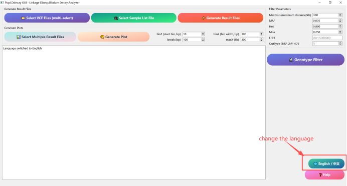
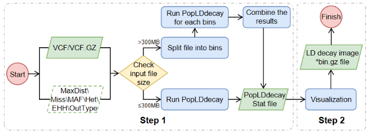
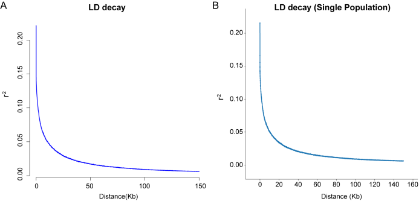
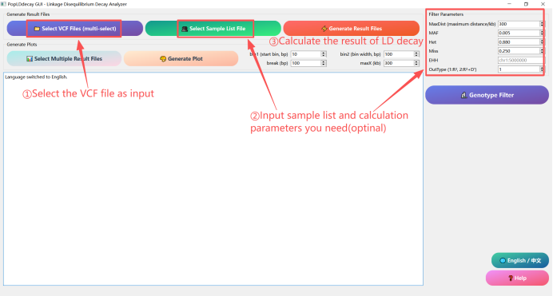
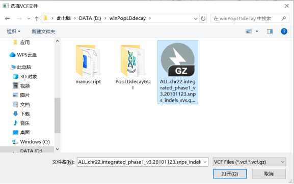
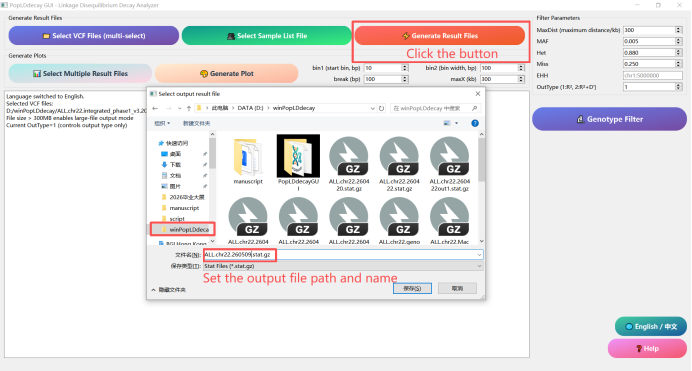
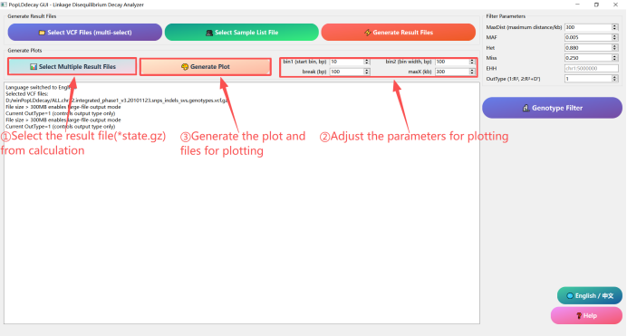

# 1. Introduction

PopLDdecayGUI (WinPopLDdecay) is a graphical user interface (GUI) software designed for Windows systems, developed based on the bioinformatics tool PopLDdecay (v3.43). PopLDdecay is primarily used for analyzing population linkage disequilibrium (LD) decay, which plays a crucial role in population genetics research. PopLDdecayGUI provides a graphical encapsulation of the original PopLDdecay functionalities that would otherwise require complex command-line operations, enabling researchers unfamiliar with command-line interfaces to utilize it effortlessly. Through simple mouse clicks and parameter configurations, users can complete tasks such as LD decay analysis, significantly lowering the technical barrier, improving analytical efficiency, and advancing population genetics research.

**New features in each version**
- V1.0: The first publicly released version.
---

# 2. Installation

## 2.1 Installation conditions
- **Operating System**: Windows 10/Windows 11 or higher versions (64-bit recommended).
- **Dependent environment**: Python 3 (for drawing and splitting large files, 3.10 or above, common packages such as matplotlib, numpy and pandas need to be installed); The main program of PopLDdecay and its dependencies (have been integrated into this GUI installation package and do not require separate installation).

## 2.2 Installation method

### 2.2.1 Download the program setup package

Download the PopLDdecayGUI installer compressed package from the project's homepage link and directly extract it to any directory (such as `D:\PopLDdecayGUI`). Then double-click `PopLDdecayGUI_Setup.exe` and follow the prompts to complete the customization options and installation.
Program GitHub Cite: [WinPopLDdecay](https://github.com/ctan2020/WinPopLDdecay)

### 2.2.2 Configure the Python environment (for plotting only)

If you have the need for drawing, please first ensure that [Python3](https://www.python.org/downloads/windows/) is installed and added to the system environment variables.
Install Python according to the installation instructions and add it to the environment variables.
Press the keyboard shortcut `Win + R` to open the command window, then type `cmd` and press Enter to access the command line interface. Or search for and use the built-in PowerShell command line of Windows.
Open the command line window and enter the following command to install the python drawing dependency package (if not installed):

```bash
# Check if Python has been successfully installed
python --version
# install python Drawing dependency package
pip install matplotlib numpy pandas
```
If python was installed successfully, you will see the following answer of the version number for `python --version` like `python 3.10.7`.
The following screenshot indicates that the relevant package has been installed:

### 2.2.4 Start the program

Double-click `PopLDdecayGUI.exe` in the PopLDdecayGUI folder under the installation path to start the program. The appearance of the following interface indicates that the startup was successful.
If you find that the language of the GUI is unfamiliar, you can click the `中文/English` button to switch it.

---

# 3. Exploitation and design

PopLDdecayGUI was designed with full consideration of the memory and hard disk usage of Windows users. Its specific operation idea is as follows:

1. First, the program receives the input file and checks the relevant parameters. If there are any abnormalities in the parameters, the program will exit directly. If the parameters are normal, proceed with the subsequent steps.
2. Next, the program will determine the size of the input file. If the file size is less than 300MB, the program will directly call PopLDdecay for analysis. If the file size is larger than 300MB, the program will split the input data into multiple 300MB data blocks and store them in a temporary temp directory. Each time a block file is generated, the program immediately calls PopLDdecay to perform statistical analysis on the file. After the statistics are completed, to save hard disk space, the program will promptly delete the block file and then proceed to process the next block file. After all the block files have completed the statistical analysis, the program will merge all the statistical results.
3. Finally, the program will perform visualization processing based on the final (merged) statistical results and generate corresponding graphics to enable users to view and analyze the data more intuitively. Such processing significantly reduces memory usage and does not occupy too much hard disk space.

---

# 4. Results evaluation

To comprehensively evaluate the software, we used Chr22 from the [1000 Genomes Project data](https://hgdownload.cse.ucsc.edu/gbdb/hg19/1000Genomes/phase3/) for testing to assess the performance and result accuracy of PopLDdecayGUI. Because PopLDdecayGUI only splits and statistically analyzes large files, and most Windows devices have limited memory and storage, a single chromosome, Chr22, was measured. The same VCF file was analyzed using the command line (PopLDdecay v3.4.3) and GUI (WinPopLDdecayGUI v1.0) respectively. The results showed that the contents of the files (such as `.stat.gz`) were basically the same, and the maximum and minimum values were also basically the same.

**Example:** A is from PopLDdecay v3.4.3; B is from WinPopLDdecayGUI v1.0.

***

# 5. Operating instructions

## 5.1 LD decay calculation

1. Click the `Select VCF File (multi-select)` button and choose one or more genotype files in VCF or VCF.GZ format.

2. Click the `Select Sample List File` button and choose a txt file containing the sample name (the sample name can be separated by a newline character, TAB character, or space, and is optional). And adjust the custom parameters on the right side (optional). The parameter settings are basically the same as those in the command-line version, including MaxDist, MAF, Het, Miss, EHH, and OutType. MaxDist is used to set the maximum SNP distance for analysis, and the default is 300 (it is not recommended to set MaxDist too large when using the large file calculation mode).

3. Click the `Generate Result File` button, select the output path for each VCF file in sequence, and the program will automatically generate the analysis result file.

## 5.2 Generate the result image

1. Click the `Select Multiple Result Files` button and choose the calculated `.stat.gz` analysis result file (single and multiple selections are both available).

2. Set the parameters bin1 (short-distance box division width, bp), bin2 (long-distance box division width, bp), and break (long and short distance division points) to smooth the LD curve. In continuous tasks, the maxX parameter in this step's drawing and the MaxDist parameter in the first step's calculation process are linked to ensure that sufficient information is displayed at an appropriate scale as much as possible.

3. Click the `Generate Plot` button, select the output image path, and the program will automatically generate LD decay images and the required files for drawing.

## 5.3 Results and tips

- All analysis and graphing results will be prompted in a pop-up window upon completion of the analysis.
- log prompt information will be displayed in the blank text box of the main interface.
- If you have any questions, please contact the developer.

---

# 6. Other information

**Quick Help Documentation**
Click the pink "Help" button at the lower right corner of the main interface to view the text-based operation instructions at any time.

**FAQ**
- If errors occur during operation, please check whether the input file path, parameter settings and Python environment are correct.
- If the image has not been generated, please confirm whether Python, matplotlib, numpy and pandas are installed.
- If there are no issues with the environment and data but an error still occurs, please contact the developer.

**Contact information**
If you have any questions or suggestions, please contact the developer at email: **1994065104@qq.com**

**Open Source and updates**
This project uses the MIT license and is continuously maintained. Welcome to follow the project homepage to obtain the latest version and update logs.

**GitHub cite**: [WinPopLDdecay](https://github.com/ctan2020/WinPopLDdecay)